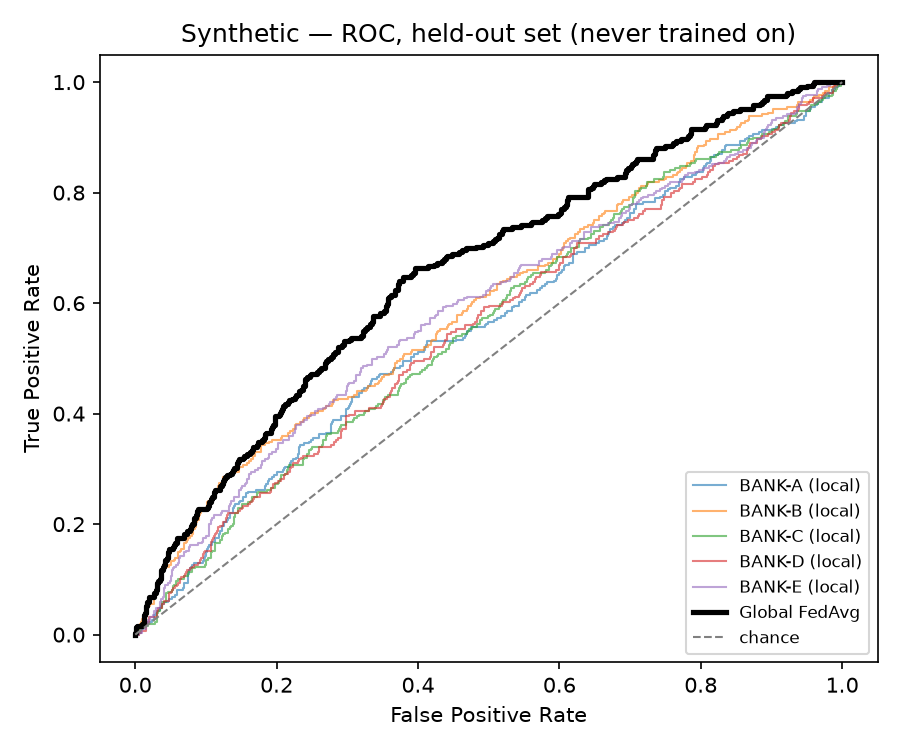
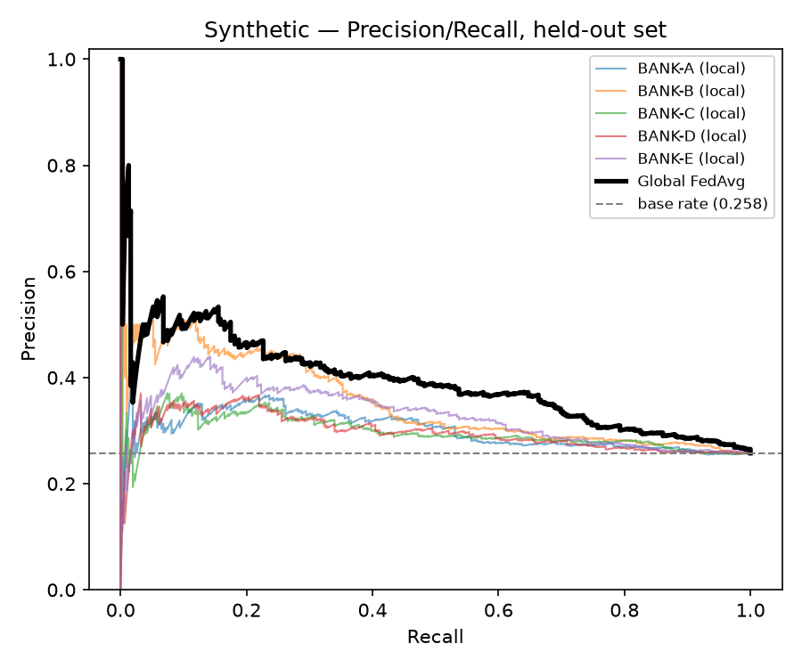
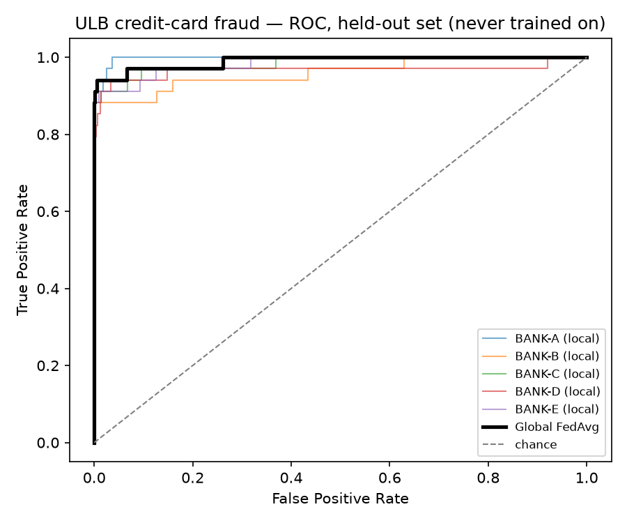
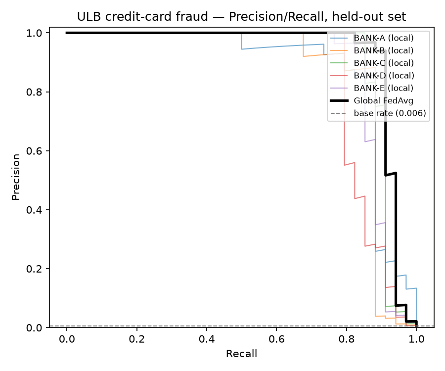

# Model metrics — every bank, the global model, both datasets

All numbers and curves on this page come from a real training run on this
machine, never hand-typed. Regenerate them yourself with:

```bash
pip install -e ".[dev,ml,viz]"

ARIS_SALT=$(python -c "import secrets;print(secrets.token_hex(32))") \
    python -m aris.fl.run --dataset synthetic
ARIS_SALT=$(python -c "import secrets;print(secrets.token_hex(32))") \
    python scripts/generate_metrics_report.py --dataset synthetic

ARIS_SALT=$(python -c "import secrets;print(secrets.token_hex(32))") \
    python -m aris.fl.run --dataset ulb --max-rows 30000 --rounds 5 --epochs 2
ARIS_SALT=$(python -c "import secrets;print(secrets.token_hex(32))") \
    python scripts/generate_metrics_report.py --dataset ulb \
        --max-rows 30000 --rounds 5 --epochs 2
```

`aris.fl.run` writes the tables' numbers to `data/processed/m1_metrics_<dataset>.json`.
`generate_metrics_report.py` retrains the same split independently (never
reads that JSON) and renders the curves below — the two are cross-checked
against each other in the runbook, not assumed consistent.

All models are evaluated only on a holdout split carved out **before**
any bank's training client is constructed (`src/aris/fl/run.py`,
`pooled_holdout_from_shards` for synthetic / time-ordered cut for ULB) —
every number and every curve point on this page is unseen-data
performance, not training-set performance.

---

## Synthetic — 5 banks, 8 rounds × 4 local epochs

Each bank's fraud is driven by a different, otherwise-unused feature
(`f0`..`f4`); the holdout pools rows from all 5 banks, so no single bank's
local model ever saw the other 4 banks' fraud pattern. Fraud rate in the
holdout: 309/1200 (~25.8%).

| Model | AUC | PR-AUC | Accuracy @ 0.5 | Recall @ 5% FPR | FPR @ 50% recall |
| --- | --- | --- | --- | --- | --- |
| BANK-A (local only) | 0.560 | 0.302 | 0.626 | 0.065 | 0.391 |
| BANK-B (local only) | 0.597 | 0.354 | 0.638 | 0.126 | 0.378 |
| BANK-C (local only) | 0.560 | 0.300 | 0.624 | 0.078 | 0.422 |
| BANK-D (local only) | 0.555 | 0.298 | 0.591 | 0.074 | 0.416 |
| BANK-E (local only) | 0.589 | 0.329 | 0.629 | 0.097 | 0.342 |
| Mean of 5 local models | 0.572 | 0.316 | 0.622 | 0.088 | 0.390 |
| **Global FedAvg** | **0.655** | **0.392** | **0.661** | **0.155** | **0.277** |

<p float="left">
  
  
</p>

**What the curves show that the table alone doesn't:** the global FedAvg
line (bold black) sits above every single bank's local curve across almost
the entire ROC and PR range — not just in the summary AUC number. This is
the direct visual evidence for why federation helps here: each bank alone
only has one weak feature's worth of signal, and combining all 5 banks'
updates (without any bank ever seeing another's raw rows) recovers the
signal no individual bank could see on its own.

---

## ULB credit-card fraud — 5 banks, temporal shards, 5 rounds × 2 epochs

Real, PCA-anonymized transaction data (auto-downloaded, capped at 30k rows
keeping all fraud). Banks are split by **time window**, not by identity —
each bank trains on a different slice of the timeline, and the holdout is
the most recent time slice, unseen by any bank during training. Fraud rate
in the holdout: 34/6000 (~0.57%) — far more imbalanced than synthetic,
which is why accuracy is a much weaker headline metric here (predicting
"not fraud" for every row would already score >99%).

| Model | AUC | PR-AUC | Accuracy @ 0.5 |
| --- | --- | --- | --- |
| BANK-A (local only) | 0.997 | 0.879 | 0.981 |
| BANK-B (local only) | 0.960 | 0.866 | 0.990 |
| BANK-C (local only) | 0.984 | 0.904 | 0.988 |
| BANK-D (local only) | 0.967 | 0.846 | 0.978 |
| BANK-E (local only) | 0.984 | 0.882 | 0.973 |
| Mean of 5 local models | 0.978 | 0.875 | 0.982 |
| **Global FedAvg** | **0.990** | **0.926** | **0.983** |

<p float="left">
  
  
</p>

**Is 0.99 AUC overfitting?** No — checked directly, not assumed. The same
global model scored against the *training* rows it did see gets AUC
0.9945; scored against this *holdout* it never saw, AUC 0.9902. A 0.004
gap is what genuine generalization looks like — overfitting would show up
as a large gap (near-perfect on train, much worse on holdout), not an
near-identical one. ULB's `V1`-`V28` PCA features are also known to be
highly separable for fraud in general — published results on this exact
dataset routinely report AUC in the 0.95-0.99 range with standard models,
so this is consistent with the wider literature, not an outlier result.

---

## Why AUC/PR-AUC lead, and accuracy is secondary

Both datasets are imbalanced (26% and 0.6% fraud respectively). A model
that predicts "not fraud" for every row scores ~74% and ~99% accuracy on
them respectively while catching zero fraud — so accuracy alone can look
good while being useless. AUC and PR-AUC don't have that failure mode,
which is why they're reported first on this page and accuracy is reported
alongside them, never in place of them. See `src/aris/fl/metrics.py`.

## Reproducibility notes

- Every number and curve above was generated on this machine, on the
  commit these docs ship with — see `docs/REVIEW_RUNBOOK.md` section 3 for
  the exact commands to run live in front of a reviewer.
- `scripts/generate_metrics_report.py` retrains local baselines and the
  federated model independently of `python -m aris.fl.run`, using the same
  `TrainConfig` defaults and the same partition/holdout logic
  (`src/aris/fl/partition.py`) — the two paths agreeing (see the
  cross-check line each run prints) is itself evidence the split is
  deterministic and leakage-free, not just an assertion.
- The `viz` extra (`matplotlib`) is only used by this report script; it is
  never imported by `src/aris` itself.
